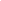

# weblogcat

Browser-based Android `logcat` viewer. Plug a phone into your laptop, click
**Connect**, and watch live logs stream in the browser — no `adb` install,
no Android Studio.

**▶ Live at <https://gabrielhuff-ai.github.io/web-logcat/>**

## Use it

1. Open the [live URL](https://gabrielhuff-ai.github.io/web-logcat/) in
   Chrome, Edge, or another Chromium-based browser. (WebUSB isn't
   available in Firefox or Safari.)
2. Plug in an Android device with USB debugging enabled.
3. Click **Connect a device** and accept the on-device authorisation
   prompt the first time.
4. Live logs stream in.

The browser remembers the trust the same way it remembers any WebUSB
permission — the second connect from the same browser+device pair is
silent.

> Don't have a phone handy? Click **fake data** instead. The UI runs
> against a synthetic `logcat` feed so you can poke around the filter
> bar, the heatmap, and the keyboard shortcuts without touching real
> hardware.

### Filter chips

Focus the filter bar (or press `/`) and the autocomplete shows all five
filter types as discoverable starters. Each chip narrows the visible
rows and highlights matches inline.

| Prefix | Matches | Example |
| --- | --- | --- |
| `process:` | Package name (substring) | `process:com.example` |
| `tag:` | Logcat tag (substring) | `tag:ActivityManager` |
| `pid:` | Process or thread id (exact) | `pid:1234` |
| `level:` | Log level letter | `level:E` |
| _(no prefix)_ | Search across message + tag + package | `OutOfMemoryError` |

`Tab` accepts the highlighted suggestion, `Enter` commits the chip,
`Backspace` on an empty input removes the previous chip. Adding the
first chip auto-enables "show only matches"; clear all chips to see
everything again.

### Keyboard shortcuts

| Key | Action |
| --- | --- |
| `Space` | Pause / resume the live stream |
| `/` | Focus the filter input |
| `⌘F` / `Ctrl+F` | Open the search overlay |
| `⌘K` / `Ctrl+K` | Clear the log buffer |
| `?` | Open the in-app shortcut reference |
| `Esc` | Close any open overlay |

Press `?` in-app for the always-current list.

### Other things to know

- **Levels.** Click a level pill to toggle it; double-click to solo
  (turns off all the others). Disabled levels show with a strike-through.
- **Pin a row.** Hover and click the pin icon — pinned rows stay
  sticky at the top until cleared.
- **Crash collapse.** Stack traces fold under their first line by
  default. Click "Show stack trace" to expand.
- **Heatmap gutter.** Off by default. Toggle it from Settings; click
  any second to scroll the log to that point in time.
- **Wrap mode.** Off by default — long messages scroll horizontally.
  Flip the `wrap` toggle to wrap them within the row instead.
- **Filters persist.** Chips are remembered per-device-serial, so a
  developer who comes back to the same phone gets their filter bar back.

## Compatibility

- **Browser:** Chromium-based only. Chrome, Edge, Brave, Opera all work.
  Firefox and Safari don't ship WebUSB.
- **Transport:** HTTPS or `localhost`. Serving from any other origin
  blocks the WebUSB device chooser.
- **Device:** Android with USB debugging on, modern enough to ship the
  ADB protocol Google has used for ~a decade. (Anything Pixel-era is
  fine.)

## Repository

Code overview, deployment, and contribution guidance each live in their
own document — these are the source of truth, this README just points
at them.

| Document | Use it for |
| --- | --- |
| [docs/ARCHITECTURE.md](docs/ARCHITECTURE.md) | Module map, top-level state shape, perf notes |
| [docs/DEPLOYMENT.md](docs/DEPLOYMENT.md) | Staging vs production, the `gh-pages` deploy mechanic |
| [docs/TASKS.md](docs/TASKS.md) | Historic backlog (mostly checked off; reference for what's intentionally not built) |
| [CONTRIBUTING.md](CONTRIBUTING.md) | Branch strategy, dev / lint / test commands, deploy gates |
| [CLAUDE.md](CLAUDE.md) | Implicit prompt for AI agents continuing the work |
| [design/HANDOFF.md](design/HANDOFF.md) | The original Claude Design brief; visual intent + token system |

Stack at a glance: Vite + React + TypeScript, CSS custom properties
with `oklch()`, [`@yume-chan/adb`](https://github.com/yume-chan/ya-webadb)
for the WebUSB transport, [`@tanstack/react-virtual`](https://tanstack.com/virtual)
for the log list, GitHub Pages for hosting. Bundle is ~64 KB gzip
initial; the ADB client (~18 KB) and the simulator (~4 KB) are
code-split and fetched on demand.

## License

MIT — see [LICENSE](LICENSE).
