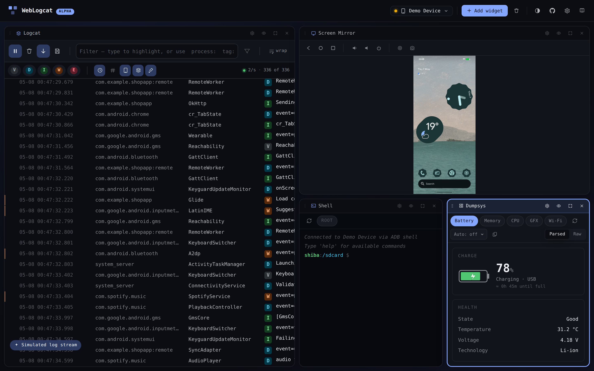

# web-logcat

Browser-based Android device inspector — Logcat, Shell, Dumpsys, Files,
and Screen Mirror, all over WebUSB. Plug a phone into your laptop and
get a draggable dashboard of widgets in the browser, no `adb` install
and no Android Studio.

**▶ Live at <https://gabrielhuff.github.io/web-logcat/>**
&nbsp;·&nbsp; **📚 Docs at <https://gabrielhuff.github.io/web-logcat/docs/>**

## Use it

1. Open the [live URL](https://gabrielhuff.github.io/web-logcat/) in
   Chrome, Edge, or another Chromium-based browser. (WebUSB isn't
   available in Firefox or Safari.)
2. Plug in an Android device with USB debugging enabled.
3. Click **Connect a device** and accept the on-device authorisation
   prompt the first time.
4. The dashboard mounts with a single Logcat tile filling the viewport.
   Use **+ Add widget** in the topbar to grow the layout — Shell,
   Dumpsys, Files, Screen Mirror, or another Logcat. Each new widget
   splits the focused tile.

The browser remembers the trust the same way it remembers any WebUSB
permission — the second connect from the same browser+device pair is
silent.

> Don't have a phone handy? Click **fake data** instead. The dashboard
> runs against a synthetic feed so you can poke around every widget,
> drag tiles, and try the keyboard shortcuts without touching real
> hardware.

## Widgets

| Widget | What it does |
| --- | --- |
| **Logcat** | Live system log stream (V/D/I/W/E levels, filter chips, search, heatmap, pinned rows). Multiple Logcat tiles can co-exist with independent filter state. |
| **Shell** | Interactive ADB shell — one channel per widget instance. ↑/↓ history, Ctrl+L clears. |
| **Dumpsys** | One-click presets (Battery, Memory, CPU, GFX, Wi-Fi) with parsed cards or raw output. |
| **Files** | Two-column file browser over the ADB sync protocol. Drag-out to pull, drag-in to push, with progress for files ≥1 MB. |
| **Screen Mirror** | scrcpy-style live screen with WebCodecs H.264 decode, tap injection, hardware buttons, screenshot, and MP4 recording. Capped at one instance. |

Drag the bottom-right grip on any tile to resize, the header to move,
and use the eye icon to hide a widget's toolbar for more content area.
The **Reset layout** button in the topbar restores the default
arrangement.

### Logcat widget

The five widgets each have their own UI conventions; Logcat carries
over most of v1's filter / search / pin / crash-collapse / heatmap
behaviour:

#### Filter chips

Focus the filter bar (or press `/`) and the autocomplete shows all five
filter types as discoverable starters. Each chip narrows the visible
rows and highlights matches inline.

| Prefix | Matches | Example |
| --- | --- | --- |
| `process:` | Package name (substring) | `process:com.example` |
| `tag:` | Logcat tag (substring) | `tag:ActivityManager` |
| `pid:` | Process or thread id (exact) | `pid:1234` |
| `level:` | Log level letter | `level:E` |
| _(no prefix)_ | Search across message + tag + package | `OutOfMemoryError` |

`Tab` accepts the highlighted suggestion, `Enter` commits the chip,
`Backspace` on an empty input removes the previous chip. Adding the
first chip auto-enables "show only matches"; clear all chips to see
everything again.

#### Keyboard shortcuts

Shortcuts only fire while the Logcat widget owns focus, so two Logcat
tiles never toggle each other.

| Key | Action |
| --- | --- |
| `Space` | Pause / resume the live stream |
| `/` | Focus the filter input |
| `⌘F` / `Ctrl+F` | Open the search overlay |
| `⌘K` / `Ctrl+K` | Clear the log buffer |
| `?` | Open the in-app shortcut reference |
| `Esc` | Close any open overlay |

Press `?` in-app for the always-current list.

#### Other Logcat conventions

- **Levels.** Click a level pill to toggle it; double-click to solo
  (turns off all the others). Disabled levels show with a strike-through.
- **Pin a row.** Hover and click the pin icon — pinned rows stay
  sticky at the top until cleared.
- **Crash collapse.** Stack traces fold under their first line by
  default. Click "Show stack trace" to expand.
- **Heatmap gutter.** A 60-cell bar on the left of the log area; click
  any second to scroll the log to that point in time.
- **Wrap mode.** Off by default — long messages scroll horizontally.
  Flip the `wrap` toggle to wrap them within the row instead.
- **Filters persist.** Chips are remembered per-device-serial **and per
  tile**, so two Logcat tiles on the same phone keep independent
  setups across reloads.

## Compatibility

- **Browser:** Chromium-based only. Chrome, Edge, Brave, Opera all work.
  Firefox and Safari don't ship WebUSB. Screen Mirror additionally needs
  WebCodecs (Chromium 94+).
- **Transport:** HTTPS or `localhost`. Serving from any other origin
  blocks the WebUSB device chooser.
- **Device:** Android with USB debugging on, modern enough to ship the
  ADB protocol Google has used for ~a decade. Shell, Dumpsys, and Files
  rely on the shell-protocol v2 spawn (`adb` v2.x); older devices fall
  back to an inline notice. Mirror requires a device able to run
  `scrcpy-server-v2.7.jar`, which the app pushes for you.

## Repository

The published [docs site](https://gabrielhuff.github.io/web-logcat/docs/)
is the source of truth for everything below. This README just points at
the relevant section.

| Section | Use it for |
| --- | --- |
| [Features](https://gabrielhuff.github.io/web-logcat/docs/features/) (`docs/features/`) | Per-widget user docs — usage, shortcuts, screenshots |
| [Contributing](https://gabrielhuff.github.io/web-logcat/docs/devs/) (`docs/devs/`) | Architecture, deployment, release plan, contributing guide, docs conventions |
| [For agents](https://gabrielhuff.github.io/web-logcat/docs/bots/) (`docs/bots/`) | Widget contract, doc-sync rules, test-sync rules |
| [`CLAUDE.md`](CLAUDE.md) | Implicit prompt for AI agents continuing the work — points into `docs/bots/` |

Stack at a glance: Vite + React + TypeScript, CSS custom properties
with `oklch()`, [`@yume-chan/adb`](https://github.com/yume-chan/ya-webadb)
for the WebUSB transport (with `@yume-chan/scrcpy` +
`@yume-chan/scrcpy-decoder-webcodecs` + `mp4-muxer` for Mirror),
[`@tanstack/react-virtual`](https://tanstack.com/virtual) for the log
list, GitHub Pages for hosting.

Bundle is **~67 KB gzip initial** (index + Logcat) plus per-widget
chunks fetched on first add (Phase 10 lazy-loading): Shell ~3.5 KB
gzip, Mirror ~5 KB, Files ~7 KB, Dumpsys ~9 KB, with the scrcpy decoder
+ mp4-muxer (~17 KB combined) only loaded once a Mirror tile mounts.
The ADB transport (~14 KB) and the simulator (~4 KB) remain lazy too.

## License

MIT — see [LICENSE](LICENSE).
