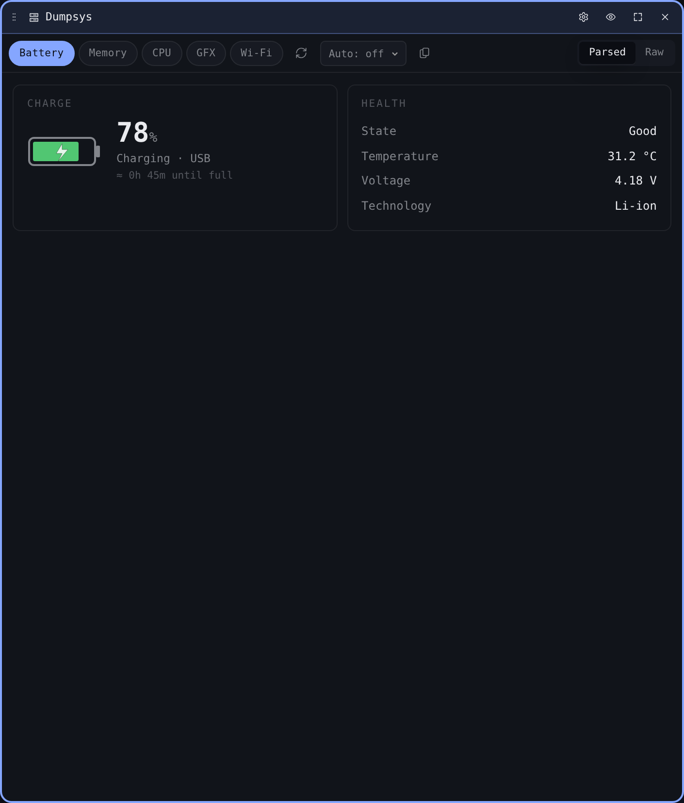

# Dumpsys

`dumpsys` is Android's general-purpose service introspection command —
it'll happily print thousands of lines about a service's internal state.
The Dumpsys widget wraps the most common services in **presets**, runs
the underlying command, and renders the result as either parsed cards or
the raw output.

## Presets

The pill row at the top of the widget chooses what to dump:

| Preset | Service | What you get |
| --- | --- | --- |
| **Battery** | `battery` | Charge state, level, voltage, temperature, plugged status. |
| **Memory** | `meminfo` | System memory summary, top RAM consumers, oom_adj buckets. |
| **CPU** | `cpuinfo` | Per-process CPU usage, load averages. |
| **GFX** | `gfxinfo` | Frame timing histogram, jank percentage, render thread stats. |
| **Wi-Fi** | `wifi` | Connected SSID + BSSID, signal strength, supplicant state, scan cache. |

Each preset has bespoke parser logic that picks out the fields most
people actually look at.

## View modes

A segmented control flips between two renderings:

- **Cards** — parsed, named, and laid out for skimming. The most useful
  signals (battery temperature, meminfo summary, current SSID) get their
  own cards; less interesting fields collapse under a *more* fold.
- **Raw** — the verbatim output of `dumpsys <service>`. Useful for
  copying into a bug report or grepping for something the parser doesn't
  surface.

The view mode is per-tile and persists.

## Refresh

The refresh icon re-runs the current preset. Output is **not**
streamed — `dumpsys` takes a one-shot snapshot.

## Per-widget settings

The cog opens a settings modal with:

- **Default preset.** Which preset the widget mounts on.
- **Default view.** Cards or Raw.

Two Dumpsys tiles can sit side by side with different presets pinned —
one watching Battery, another watching GFX during a perf investigation.
