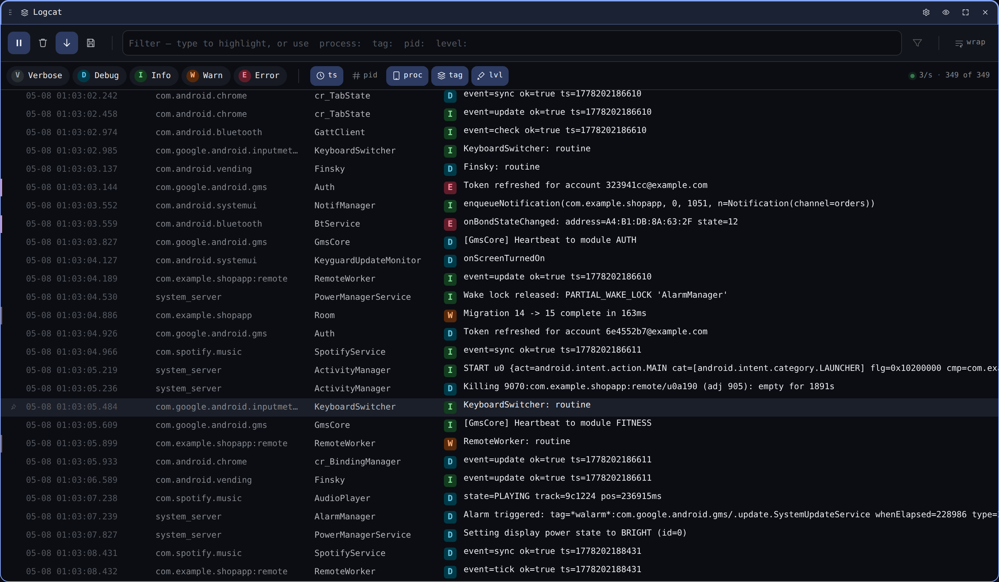
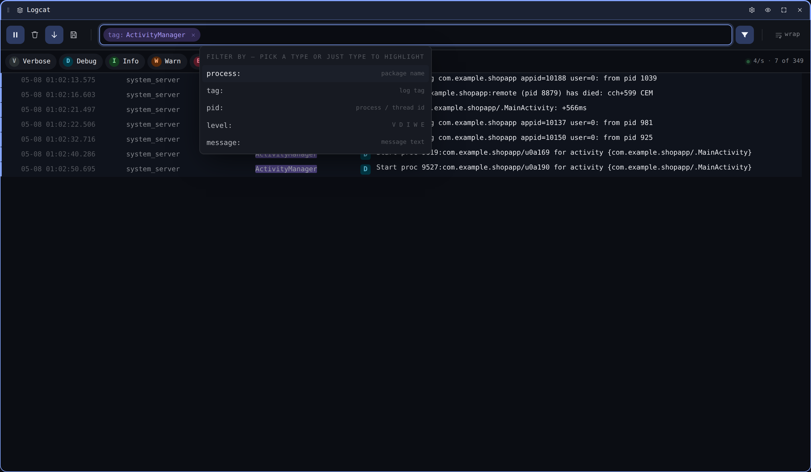
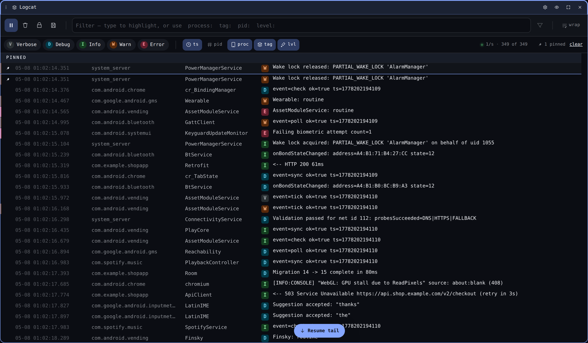

# Logcat

The Logcat widget streams the device's system log live. Multiple Logcat
tiles can co-exist on the same device with independent filter and pin
state, so you can keep a global view alongside a tag-scoped one.

## Filter chips

Focus the filter bar (or press `/`) to bring up the autocomplete. All five
filter types appear as discoverable starters:

| Prefix | Matches | Example |
| --- | --- | --- |
| `process:` | Package name (substring) | `process:com.example` |
| `tag:` | Logcat tag (substring) | `tag:ActivityManager` |
| `pid:` | Process or thread id (exact) | `pid:1234` |
| `level:` | Log level letter | `level:E` |
| _(no prefix)_ | Search across message + tag + package | `OutOfMemoryError` |

`Tab` accepts the highlighted suggestion, `Enter` commits the chip,
`Backspace` on an empty input removes the previous chip. Adding the
first chip auto-enables *show only matches*; clear all chips to see
everything again.

## Level pills

The five level pills (V/D/I/W/E) above the log show the live rate per
level.

- **Click** a pill to toggle that level on / off.
- **Double-click** to *solo* — turns every other level off.
- A struck-through pill means the level is hidden.

## Search overlay

`⌘F` (or `Ctrl+F`) opens a floating search box that matches across the
visible rows and scrolls the next match into view. `Esc` dismisses it.

## Pinned rows

Hover a row and click the pin icon to stick it to the top of the log.
Pinned rows survive scrolling and stay visible even when their original
position scrolls off-screen. Click the pin again to unpin.

## Crash collapse

Stack traces fold under their first line by default. Click *Show stack
trace* on a folded row to expand it. The collapse heuristic recognises
both Java exceptions and ANR / native traces.

## Heatmap gutter

A 60-cell bar on the left of the log area buckets the last minute of
activity into one cell per second. Cell brightness scales with rate;
click any second to scroll the log to that point in time.

## Wrap mode

Off by default — long messages scroll horizontally so timestamps stay
aligned. Toggle **wrap** in the toolbar (or via the per-widget settings
modal) to wrap long messages within the row.

## Pause and clear

- `Space` toggles pause. While paused, incoming entries queue up and
  flush in batch when you resume.
- `⌘K` / `Ctrl+K` clears the visible buffer (the upstream stream keeps
  going).

## Per-widget settings

The cog in the tile header opens a settings modal for **this** Logcat
instance. From there you can flip wrap, change row density, edit the
default level mask, or rename the tile. Changes persist per-tile.

## Keyboard shortcuts

Shortcuts only fire while the widget owns focus, so two Logcat tiles
never toggle each other.

| Key | Action |
| --- | --- |
| `Space` | Pause / resume the live stream |
| `/` | Focus the filter input |
| `⌘F` / `Ctrl+F` | Open the search overlay |
| `⌘K` / `Ctrl+K` | Clear the log buffer |
| `?` | Open the in-app shortcut reference |
| `Esc` | Close any open overlay |

Press `?` in-app for the always-current list.
