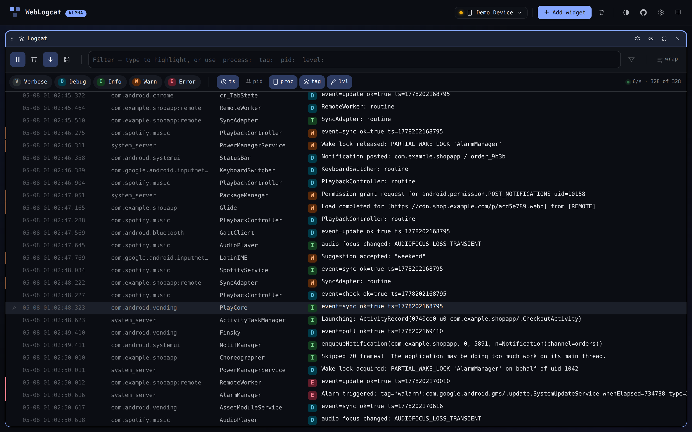

# Simulated stream

Click **fake data** on the empty state to swap a real device for an
in-memory simulator. Every widget keeps working — Logcat replays a
synthetic event stream, Shell answers a few common commands from a
host-side fake, Dumpsys serves canned output, Files browses an in-memory
tree, and Mirror renders a static device home screen.

## Why use it

- **Try the app without a phone.** Useful for evaluating the dashboard,
  sharing screenshots, or designing a layout you'll use later on real
  hardware.
- **Demo / docs.** Every screenshot in this site is captured against the
  simulator (with the exception of real-device-only flows, which are
  flagged).
- **Tests.** WebLogcat's e2e suite drives every widget through the
  simulator path because real WebUSB cannot be exercised in headless CI.
  See [test-sync rules](../bots/test-sync) for the contract.

## What's faked

| Widget | Source |
| --- | --- |
| Logcat | `lib/logGenerator.ts` — synthesises ~5–20 entries / sec across realistic packages and tags. |
| Shell | `lib/shellSim.ts` — recognises a small set of built-ins (`pwd`, `ls`, `cat`, `whoami`, etc.) and a tiny in-memory FS under `/sdcard/`. |
| Dumpsys | Captured fixtures for each preset, parsed by the same code path the real output uses. |
| Files | An in-memory tree rooted at `/sdcard/` with a few canned files. |
| Mirror | A static `mirror-home.png` framed inside the bezel chrome. |

The badge in the lower-right corner of the dashboard reminds you that
you're on simulated data. Switching back to a real device is one click
in the device picker.

## Stream speed

The simulator emits log entries at a configurable rate. Open the global
settings cog and adjust **Simulated stream speed** between *trickle*
(~1/s) and *firehose* (~50/s) — useful for stress-testing the Logcat
widget.

## Limitations

The simulator is intentionally shallow — it's a stand-in for "the app
works", not a faithful Android emulator. Expect:

- No real `adb` semantics: the shell built-ins don't cover the full
  toolbox; `find`, `grep`, and friends aren't there.
- No real Mirror feed: the canvas shows a static image so the widget
  chrome can be inspected.
- No real Files transfers: drag-out / drag-in are no-ops in the
  simulator.

For the real flows, pair an Android device — see
[connecting](./connecting).
